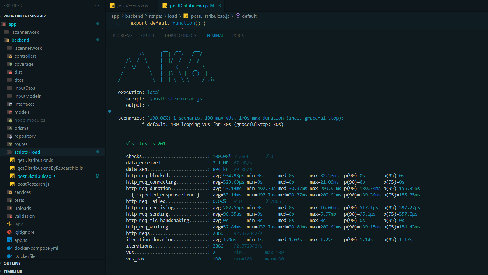

# Relatório de Teste de Carga - Endpoint de Distribuição de Pesquisa

Este relatório apresenta os resultados dos testes de carga realizados no endpoint de distribuição de pesquisa do nosso projeto utilizando a ferramenta k6. Este endpoint é essencial para o envio de pesquisas de satisfação aos clientes. Foram conduzidos dois cenários de teste com 10 e 100 usuários virtuais (VUs) para avaliar a robustez do sistema sob diferentes condições de carga.

## Metodologia

Os testes foram realizados usando a ferramenta de teste de desempenho k6. Essa ferramenta simula tráfego no sistema e coleta dados sobre o comportamento do sistema sob carga. Avaliamos métricas como tempo de resposta, conectividade, volume de dados e carga de trabalho.

## Teste com 10 Usuários

Descrição dos resultados:

- **Tempo Médio de Resposta:** O tempo médio de resposta foi de aproximadamente 53ms, indicando uma performance excelente para o contexto de atuação.
- **Tempo de Espera:** O tempo de espera, refletido pelo tempo de espera HTTP, manteve-se baixo, correlacionando-se diretamente com o tempo de resposta rápido.
- **Conectividade:** Os tempos bloqueados e de conexão HTTP foram insignificantes, sugerindo uma conectividade eficaz e inicialização rápida de conexões.
- **Volume de Dados:**  O volume de dados, tanto recebidos quanto enviados, foi mínimo, demonstrando uma troca de dados eficiente.
- **Carga de Trabalho:** A taxa de requisições foi de 10/s, com 100% de sucesso nas interações.

## Teste com 100 Usuários

Descrição dos resultados:

- **Tempo Médio de Resposta:** Com 100 usuários, o tempo médio de resposta foi cerca de 202ms, indicando um tempo médio de resposta dentro de uma faixa aceitável.
- **Tempo de Espera:**  O tempo de espera acompanhou o aumento do tempo médio de resposta, mas continuou proporcionando uma experiência de usuário positiva.
- **Conectividade:** Houve um pequeno aumento nos tempos de bloqueio e conexão, mas permaneceram dentro de faixas adequadas.
- **Volume de Dados:** O aumento da carga resultou em um maior volume de dados trocados, porém a eficiência foi mantida.
- **Carga de Trabalho:** A frequência de requisições atingiu cerca de 100/s, conforme o planejado, com uma taxa de sucesso de 100%.

## Conclusão 

Os testes indicam que o sistema pode suportar 100 usuários simultâneos sem degradação significativa no desempenho. Recomendamos monitoramento contínuo para garantir a escalabilidade e a implementação de estratégias como balanceamento de carga e escalonamento automático para acomodar picos de tráfego.

Os insights adquiridos nos ajudarão a aprimorar o sistema e a assegurar que o envio de pesquisas de satisfação seja uma experiência agradável para os usuários.

---

